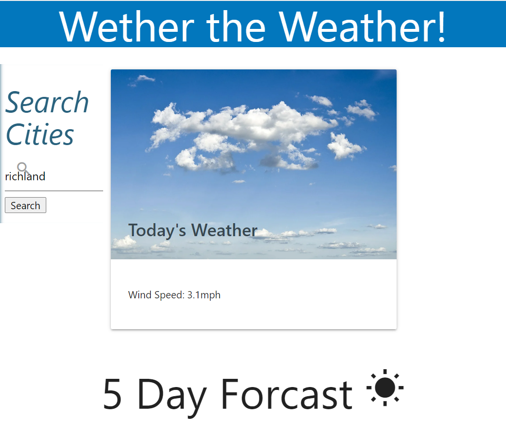

# Whether-the-Weather
Weather Dashboard Wk6 HW
## Objectives
Create a weather page that shows specific information for the current day. Then the 5 day Forcast with specified information.

Requires multiple API calls for the current day weather vs 5 day forcast and also UV index.

The app allows storage of previous cities with the ability to click and load the previous city data. Or clear to erase city from search.

## Techonologies
This assignment was a build from the foundation up. I used Materialize CSS framework alongside my html. I also used JQuery, the Open Weather API, and MomentJS.

## Future Improvements
I really love how this has come together. However I would like to work with the columns for the 5 day. I am having difficulty getting equally spaced cards so that all 5 fit centered and not pushed to one side.

I chose a group of images I thought would be nice to have display on the current day's weather card. They would change based off the icon display. 

https://wanderingtech.github.io/Whether-the-Weather/.

